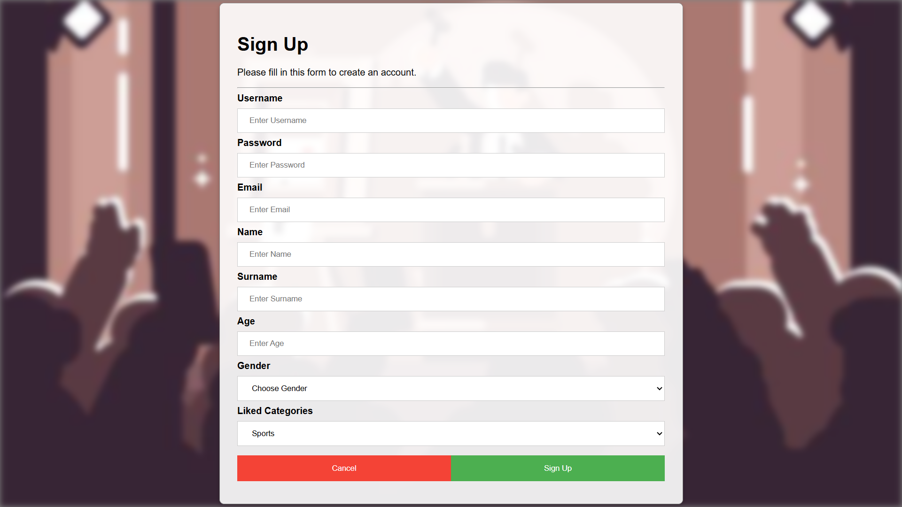
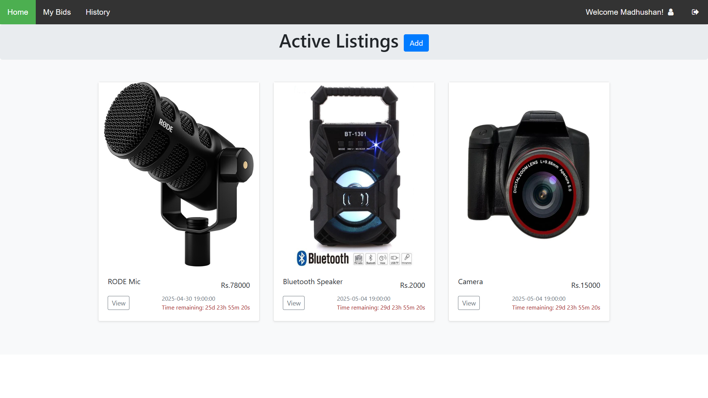
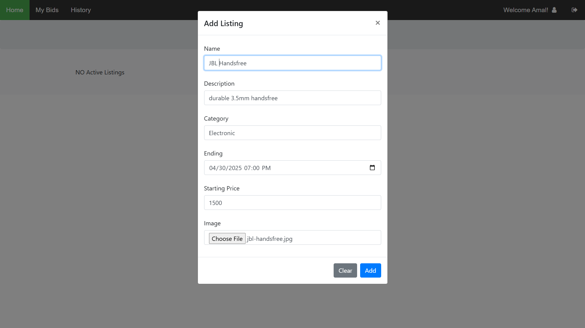
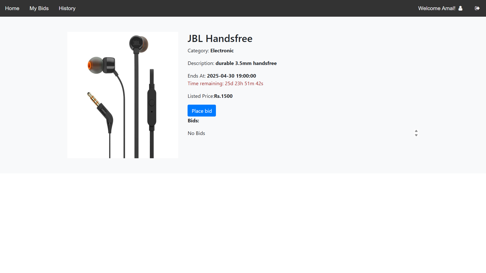
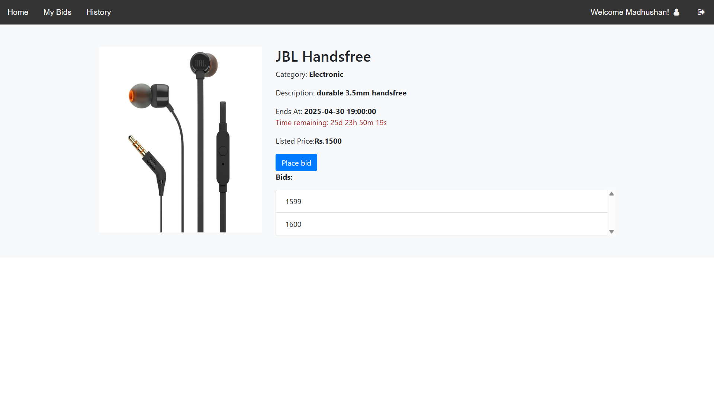
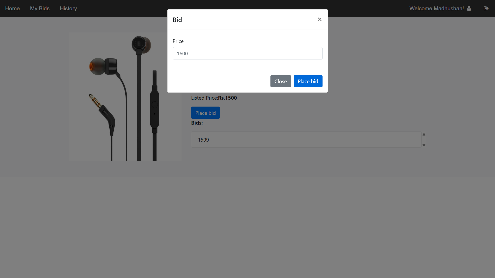
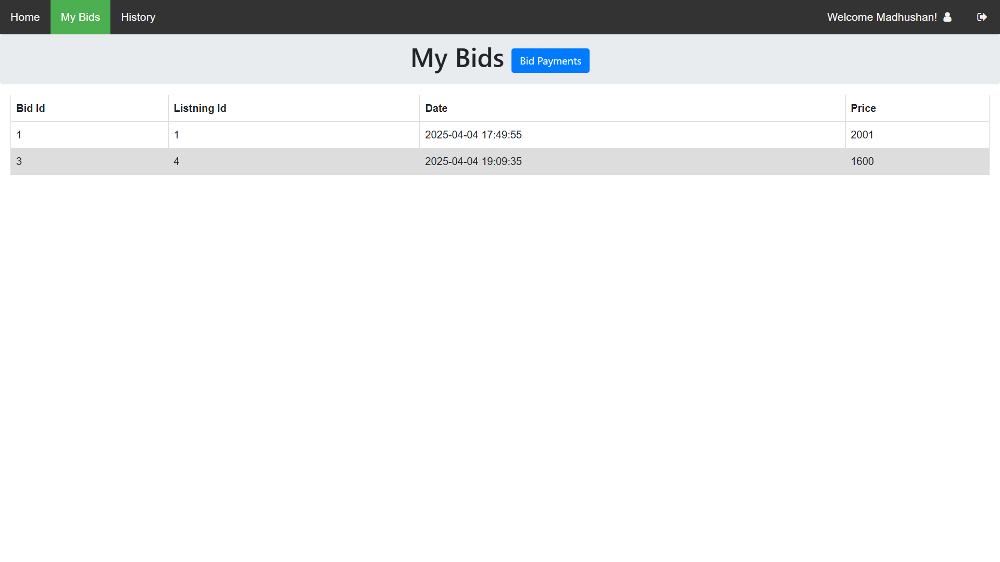

# BidZone - Online Bidding System

## Overview
BidZone is a online auction platform that enables users to create, manage, and participate in auctions. The platform provides a seamless experience for both bidders and sellers. The project is built using a combination of modern frontend technologies (HTML, CSS, JavaScript) and a robust backend powered by Spring Boot.

---
## Technology Stack
- **Spring Boot**
- **HTML**
- **CSS**
- **JavaScript**

---
## Features

### User Features
- **User Registration & Login**: Secure authentication and personalized user profiles.
- **Auction Listings**: Browse, search, and filter auction items by category or keywords.
- **Bidding System**: Place bids on active listings with real-time updates on the highest bid.
- **Bid History**: View past bids and payment details.
---

## Screenshots
### Home Page

### Sign UP

### Active Listings

### Add Product Listings

### View Product

### Place Bid

### Bid History

---

## Project Structure

### Frontend
- **HTML**: Located in `FrontEnd/HTML/`
- **CSS**: Located in `FrontEnd/resources/css/`
- **JavaScript**: Located in `FrontEnd/resources/js/`

### Backend
- **Spring Boot Application**: Handles user authentication, auction management, and API endpoints.
- **Services**: Business logic for managing bids, listings, and payments.
- **Controllers**: RESTful APIs for frontend-backend communication.
- **Entities**: Database models for users, bids, listings, and payments.

---

## Installation

### Prerequisites
- Java 17+
- Apache Maven
- MySQL Database